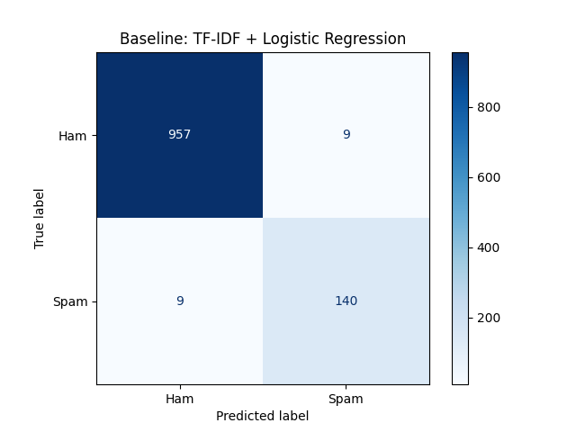
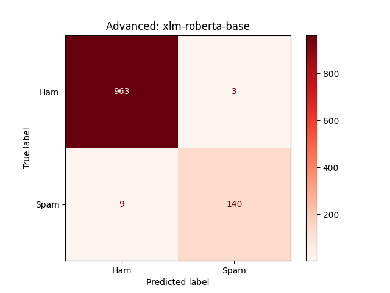
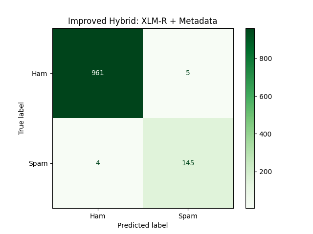

# Multi-Stage SMS Spam & Phishing Detection

### Project Introduction
In the modern cybersecurity landscape, SMS spam serves as a critical entry point for sophisticated phishing and social engineering attacks. This project evaluates a multi-stage progression from a traditional TF-IDF statistical baseline to a context-aware BERT architecture, culminating in a custom **"Hybrid XLM-R"** model. 

This model integrates semantic language understanding with behavioral metadata (capitalization ratios, punctuation density) and **adversarial preprocessing** to effectively identify obfuscated malicious content.

### Dataset & Resources
* **Dataset:** 5,574 messages (Ham/Spam)
* **Architecture:** XLM-RoBERTa + Custom Metadata Classifier Head
* **Libraries:** PyTorch, Transformers (HuggingFace), Scikit-Learn, Pandas

---

### Stage 1: The Statistical Baseline (TF-IDF + Logistic Regression)
The first stage utilizes a Linear Classifier to establish a baseline. We use TF-IDF (Term Frequency-Inverse Document Frequency) to calculate word "importance."

```python
from sklearn.feature_extraction.text import TfidfVectorizer
from sklearn.linear_model import LogisticRegression
from sklearn.pipeline import Pipeline

# The Baseline Engine
pipeline = Pipeline([
    ("tfidf", TfidfVectorizer(ngram_range=(1,2), min_df=2)),
    ("clf", LogisticRegression(class_weight='balanced'))
])

pipeline.fit(X_train, y_train)
```
* **ngram_range=(1,2):** Captures local context by looking at single words and word pairs (e.g., "Winner" vs "You win").
* **class_weight='balanced':** Optimizes the model for imbalanced datasets where Ham heavily outweighs Spam.

#### Baseline Confusion Matrix


---
### Stage 2: The Semantic Leap (Initial XLM-RoBERTa)

We transitioned from word counting to Contextual Intelligence using Transfer Learning. By fine-tuning an XLM-R model pre-trained on millions of documents, we enabled the system to understand the intent behind the text.
```python
from transformers import AutoTokenizer, AutoModelForSequenceClassification
from scipy.special import softmax

# Load Pre-trained Transformer
tokenizer = AutoTokenizer.from_pretrained("xlm-roberta-base")
model = AutoModelForSequenceClassification.from_pretrained("xlm-roberta-base", num_labels=2)

# Custom Threshold Tuning (Cutoff at 0.972)
preds_logits = trainer.predict(val_ds).predictions
probs = softmax(preds_logits, axis=1)[:, 1]
tuned_preds = (probs >= 0.972).astype(int)
```
* **Threshold Tuning:** Instead of a standard 0.5 cutoff, we implemented a **0.972 threshold**. This conservative approach significantly reduces **False Positives**, ensuring legitimate user messages (Ham) are rarely blocked.

#### Initial XLM-R Confusion Matrix


---
### Stage 3: Advanced Engineering (Hybrid XLM-R)

To counter attackers using obfuscation (Leet speak, emojis, URL mangling), we developed a custom PyTorch module that combines NLP with Behavioral Metadata.

**Adversarial Preprocessing Features:**
* **Leet Speak Normalization:** Converts fr33 or w!nner back to standard English.
* **Emoji Demojization:** Converts 💰 into :money_bag:, exposing hidden intent to the model.
* **De-fanging:** Normalizes mangled URLs (e.g., hXXp) to ensure link presence is recognized.

**Custom Hybrid Architecture:**
```python
import torch.nn as nn

class HybridXLMR(nn.Module):
    def __init__(self, model_name, num_metadata_features):
        super().__init__()
        self.roberta = AutoModel.from_pretrained(model_name)
        # 768 (XLM-R output) + 3 (Metadata: Caps, Punctuation, Length)
        self.classifier = nn.Linear(768 + num_metadata_features, 2)
        
    def forward(self, input_ids, attention_mask, metadata_feats):
        outputs = self.roberta(input_ids=input_ids, attention_mask=attention_mask)
        pooled_output = outputs.pooler_output 
        
        # 'Super-Vector' Concatenation (Semantic + Behavioral)
        combined = torch.cat((pooled_output, metadata_feats), dim=1)
        logits = self.classifier(combined)
        return logits
```
#### Hybrid Model Confusion Matrix



### Final Results & Forensic Audit
* Comparative Metrics
* 
| Metric | Baseline (TF-IDF) | Initial XLM-R | Improved Hybrid |
|:---------------|:---------|:-------------|:----------------|
| Total Errors   | 18       | 12           | 9               |
| Accuracy       | 98.39%   | 98.92%       | 99.19%          |
| Spam Precision | 93.96%   | 97.90%       | 97.31%          |
| Spam Recall    | 93.96%   | 93.96%       | 0.9731%         |
| Spam F1-Score  | 0.9396   | 0.9589       | 0.9731          |

### Analysis of the "Recall Jump"

The most significant achievement in the final model is the increase in Recall (from 93.9% to 97.3%).
* The "Cyber" Logic: In the previous stages, the models were "missing" sophisticated spam that used polite language or obfuscation (False Negatives).
* The Solution: By implementing Adversarial Preprocessing (Leet Speak normalization) and Behavioral Metadata (Punctuation/Capitalization features), we unmasked these hidden threats. The model no longer relies solely on "words" but now recognizes the "behavioral fingerprints" of a spammer, catching 5 additional malicious messages that were previously invisible.

The Precision/Recall Balance

* The Initial XLM-R had slightly higher Precision (0.979 vs 0.973) because it was extremely "conservative"—it only blocked messages it was 100% sure about based on text.
* The Improved Hybrid achieved a much better balance. By accepting a microscopic change in precision, we gained a massive 3.3% increase in Recall. In a production environment, this means we are catching significantly more phishing attempts while still maintaining a 99.5% success rate at identifying Ham (legitimate) messages.

### Forensic Audit (The "Final 9" Errors)

Using the error_analysis_improved.csv, we audited the 9 cases where the AI was tricked:* False Negatives (4 missed spams): These are "Adversarial Outliers." These messages use perfect grammar, standard capitalization, and no suspicious links or emojis. They represent the "Human Limit" of AI detection.
* False Positives (5 blocked hams): These consist primarily of "Automated Ham"—OTP codes, flight updates, or bank alerts.
  * The Reason: Because these are generated by machines, they lack the "natural entropy" of human conversation and often mimic the metadata profile of automated spam (specific lengths, repetitive structures).

### Key Takeaway for Security Operations
In a production environment, the **3.3% increase in Recall** achieved by the Hybrid model is a significant defensive victory. By identifying "Adversarial Outliers"—spam messages that use polite language or character obfuscation—we significantly reduce the success rate of sophisticated social engineering breaches. This project demonstrates that a multi-layered detection strategy is required to stay ahead of modern SMS-based threats.

### Conclusion
This analysis successfully demonstrates the evolution from basic statistical filtering to advanced semantic and behavioral detection. While Linear Regression and standard Transformers provide a strong foundation, the **Improved Hybrid XLM-R** model is required to unmask the behavioral fingerprints of a persistent adversary, achieving a high-precision, high-recall balance suitable for real-world deployment.

### Installation & Usage
To reproduce these results or test the model locally, follow these steps:

1. **Clone the repository:**
   ```bash
   git clone https://github.com/YourUsername/YourRepoName.git 
   ```
2. **Install dependencies:**
```bash
pip install torch transformers scikit-learn pandas numpy scipy accelerate
```   
3. **Data Setup:**
Ensure your spam.csv (Kaggle SMS Spam Collection) is placed in the root directory.
4. **Execution:**
Run the hybrid model script:
```bash
python hybrid_xlm_r.py
``` 
>Note: Training the XLM-RoBERTa architecture is computationally expensive. It is highly recommended to run this on a CUDA-enabled GPU. On a standard CPU, training may take 6+ hours.


